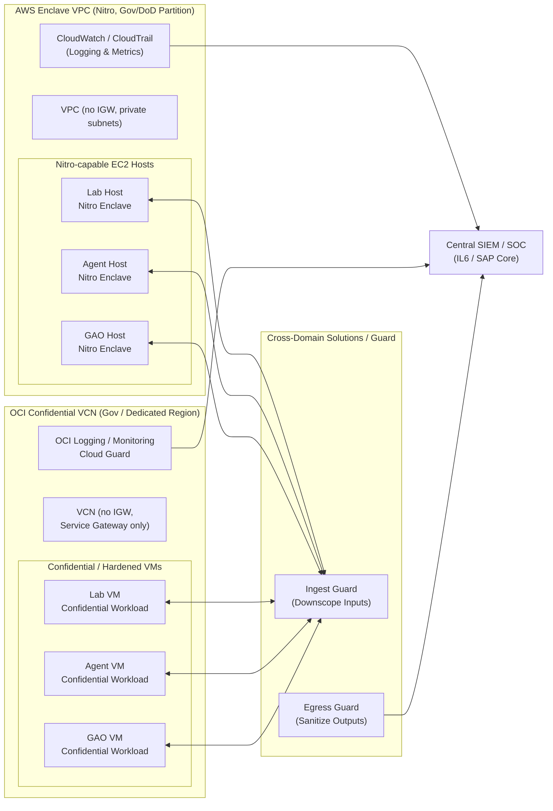

# Secure Architecture Overview (IL6 / SAP-Oriented)

This document describes the **secure deployment architecture** for the
*Persuadable Defender* research system as if it were a section in a
System Security Plan (SSP). The focus is on how the system can be deployed
inside **DoD Impact Level 6 (IL6)** and **Special Access Program (SAP)**
environments using **AWS Nitro Enclaves** and **OCI confidential / Dedicated
Region** patterns.

The goal is to show that the same cognitive-light-cone research logic can be
hosted within **defensible enclave boundaries** on multiple clouds.

---

## 1. Architectural Context

The system consists of three primary logical components:

- **Lab** – C-Lcone Behavioral Test Suite
  - Runs controlled assays against autonomous security agents.
  - Produces metrics for Temporal Discounting, Spatial Alignment, and
    Competency Overhang.

- **Agent** – Malignant Agent
  - A deliberately misaligned or locally-optimized security agent.
  - Used as a subject in experiments to surface goal dissociation.

- **GAO** – Goal-Aware Orchestrator
  - A higher-level orchestrator that uses C-Lcone metrics to gate or override
    sub-agent actions, enforcing global security policy.

These components are deployed within **isolated enclaves** in each cloud and
integrated into the larger IL6/SAP security boundary via **cross-domain
solutions (CDS)** and **centralized monitoring**.

---

## 2. High-Level Secure Architecture (Mermaid Diagram)

**Diagram notes:**

- The **AWS Enclave VPC** uses:
  - Private subnets only (no Internet Gateway).
  - **Nitro Enclave–capable EC2 instances** for each role.
  - VPC endpoints for control-plane services (e.g., CloudWatch, SSM, KMS).

- The **OCI Confidential VCN** uses:
  - Private subnets only (no Internet Gateway).
  - **Service Gateway** for OCIR and Logging/Monitoring.
  - Hardened shapes/images that can leverage hardware isolation where available.

- **CDS** sits at the security boundary:
  - Controls data entering and leaving the enclave.
  - Enforces classification and sanitization policies.

- **Central SIEM / SOC** collects:
  - Logs and metrics from both AWS and OCI monitoring stacks.
  - CDS audit logs and enclave attestation evidence.

---

## 3. AWS Nitro Enclave Boundary

From an IL6/SAP perspective, the AWS portion is designed as follows:

1. **Partition / Region**
   - Deployed in an IL6-compatible partition (e.g., AWS GovCloud, AWS Secret /
     Top Secret / DoD regions).
   - Terraform variables (`aws_region`, `partition_hint`) explicitly document
     the target partition.

2. **Network Isolation**
   - A dedicated VPC with CIDR `10.62.0.0/16` (configurable).
   - Only private subnets; **no Internet Gateway** is provisioned.
   - Security groups deny unsolicited inbound and restrict egress to:
     - VPC CIDR.
     - Interface VPC endpoints for AWS APIs (Logs, SSM, KMS, etc.).

3. **Enclave Hosts**
   - Three Nitro-capable EC2 instances are created:
     - `lab`   host.
     - `agent` host.
     - `gao`   host.
   - Each host has `enclave_options { enabled = true }` and no public IP.

4. **Enclave Workloads**
   - Each host runs a dedicated Nitro Enclave image (not provided here, but
     referenced in Bootstrap TODOs), which contains:
     - The relevant Python application code (Lab/Agent/GAO).
     - The necessary runtime (interpreter, libraries).
   - Enclave images are pulled from an **internal, signed registry** reachable
     only via VPC endpoints or equivalent secure channels.

5. **Monitoring and ATO**
   - CloudWatch Logs/CloudTrail capture:
     - Host-level events (EC2, networking).
     - Application logs emitted by enclave-attached processes.
   - Nitro attestation artifacts can be:
     - Forwarded to CM/ATO repositories.
     - Used as part of control narratives for encrypted computation and
       integrity.

This pattern is captured in `infra/aws-nitro/` and is intended to align with
requirements for STIG baselines, CM, boundary controls, and continuous
monitoring within IL6 environments.

---

## 4. OCI Confidential / Dedicated Region Boundary

On OCI, the architecture is mirrored with appropriate primitives:

1. **Region and Tenancy**
   - Deployed in an approved **Government region** or **Dedicated Region**.
   - All resources belong to a compartment scoped to the IL6/SAP enclave.

2. **VCN and Network Controls**
   - A dedicated VCN with CIDR `10.72.0.0/16` (configurable).
   - Only private subnets; **no Internet Gateway**.
   - A **Service Gateway** provides private access to:
     - OCIR for container images, if used.
     - Logging and Monitoring.
   - NSG rules:
     - Deny-all baseline.
     - Egress allowed only to VCN CIDR and Service Gateway.

3. **Confidential / Hardened Compute**
   - Three hardened VMs are provisioned:
     - `lab` VM.
     - `agent` VM.
     - `gao` VM.
   - Each uses a STIG-ready, hardened image (`image_ocid`).
   - Shapes are chosen to support hardware isolation where available (e.g.,
     AMD SEV-SNP capable shapes in future variants).

4. **Workload Hosting**
   - Each VM runs:
     - Either containerized (Docker/podman) deployments of the Lab/Agent/GAO
       services.
     - Or native Python services.
   - The VM boundary is treated as the enclave boundary, with:
     - Local hardening (CIS/STIG).
     - Strict control over outbound connections.

5. **Monitoring and ATO**
   - OCI Logging and Monitoring capture:
     - System logs, audit logs.
     - Application logs.
   - OCI Cloud Guard and Security Zones (if used) enforce baseline policies:
     - No public IPs.
     - Encryption at rest.
     - Compliance configuration drift detection.

This pattern is captured in `infra/oci-confidential/` and is intended to
slot into a full IL6/SAP ATO package as the **compute and network skeleton**.

---

## 5. Cross-Domain Solutions (CDS) and Data Flows

The cognitive-light-cone research system typically interacts with:

- **Inbound data**:
  - Sanitized security telemetry.
  - Synthetic scenarios for Lab assays.
  - Policy/goal specification from higher-level governance.

- **Outbound data**:
  - Aggregated metrics (C-Lcone scores, fitness, agency/persuadability).
  - Alerts or recommendations from GAO.
  - Logs and audit trails.

In an IL6/SAP environment:

- All cross-domain traffic must traverse approved **CDS** mechanisms.
- Terraform in this repository intentionally **does not** manage CDS; instead,
  CDS is assumed to sit at the boundary between:
  - Enclave VPC/VCN.
  - The wider IL6/SAP environment (e.g., central SIEM, upper-tier systems).

The Mermaid diagram above places CDS between enclave components and the
**Central SIEM / SOC**, emphasizing:

- Ingress guard:
  - Filters and normalizes input data entering the enclaves.
- Egress guard:
  - Scrubs or aggregates outputs before they cross classification boundaries.

---

## 6. Continuous Monitoring and Control Narratives

The architecture supports continuous monitoring and control narratives as
follows:

- **Logging and Metrics**
  - Cloud-native logging (CloudWatch, OCI Logging).
  - Flow logs (VPC/VCN) for network-forensics in the enclave.

- **Configuration Management**
  - EC2 and OCI VMs integrated with SSM / agents as permitted.
  - Terraform-managed tags providing traceability:
    - `SecurityDomain`, `Environment`, `Role`, `Project`.

- **Control Narratives**
  - Each major IA control (e.g., NIST 800-53 AC, AU, SC families) can reference:
    - The enclave VPC/VCN definitions (network isolation).
    - Nitro/VM hardening and attestation.
    - CDS placement and logging.

This document, combined with:

- `infra/aws-nitro/`
- `infra/oci-confidential/`
- `docs/ato_and_stig_checklist.md`

is meant to serve as an SSP-friendly starting point to describe how the
*Persuadable Defender* system would be securely deployed within an IL6/SAP
context across multiple clouds.
